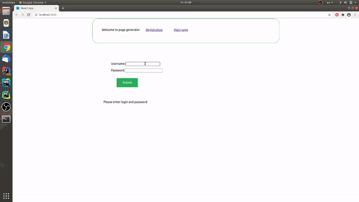

# Генератор конфеденциальных страниц
Данное приложение преобразует текст в изображение и предоставляет URL на данное изображение.
Также есть возможность задать необходимое количество открытий изображения , после которого изображение удалится.
Время и путь записываются в cookie-файлы
# Используемые технологии
### ReactJs
### NodeJs
### MongoDb
### Express
Авторизация происходит с использованием  JWT токена. Для преобразования текста в изображение используется npm модуль text-to-image.
Генерация страницы с изображением построена на движке ejs
Для редактирования cookie используется модуль react-cookie
Стили написаны на scss
# Запуск приложения
## Backend
###3.Загрузить директорию server
###2. Создать базу данных MongoDB и подключиться к ней
## Frontend
###1. Загрузить директорию client
###2. Запустить npm install
##Demo-gif

